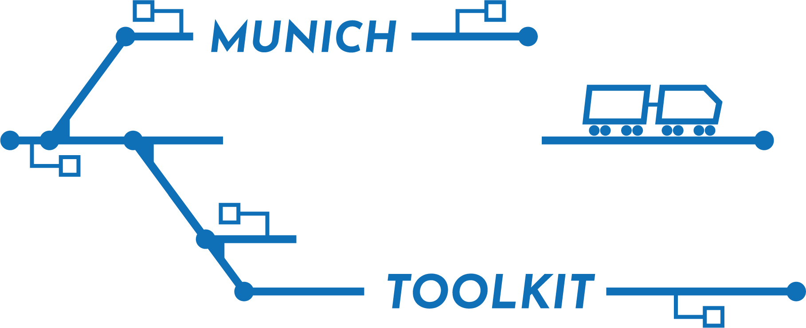

[](https://github.com/cda-tum/mtct/actions/workflows/cpp-ci.yml)
[](https://github.com/cda-tum/mtct/actions/workflows/codeql-analysis.yml)
[](https://codecov.io/gh/cda-tum/mtct)
[](https://github.com/cda-tum/mtct/blob/main/LICENSE)

# MTCT - Munich Train Control Toolkit

<p align="center">
  <picture>
    <source media="(prefers-color-scheme: dark)" srcset="_img/mtct-logo-light-medium.png" width="60%">
    
  </picture>
</p>

## A Tool for Automated Design of ETCS Systems with Hybrid Train Detection (formerly ETCS Hybrid Level 3)

Developers: Stefan Engels, Tom Peham, and Robert Wille

### Overview

The European Train Control System (ETCS) harmonizes many national train control systems.
Additionally, new specifications strive to increase the capacity of existing railway infrastructure.
ETCS Hybrid Level 3 (ETCS HL3) is of great practical interest to achieve shorter train following times.
It allows adding virtual subsections (VSS) that do not depend on trackside train detection (TTD) hardware.
However, finding optimal layouts is non-trivial and is currently done mainly manually.
In our research at the [Chair for Design Automation](https://www.cda.cit.tum.de/) of the [Technical University of Munich](https://www.tum.de/en/), we develop design methods to aid designers of such train control systems in automatically finding optimal layouts concerning various optimality criteria.

First attempts using satisfiability solvers [[1]](#references) and heuristics [[2]](#references) have been implemented at [https://github.com/cda-tum/da_etcs](https://github.com/cda-tum/da_etcs).
Since the methods used there cannot model continuous properties directly, simplifying assumptions were made.

This tool provides a flexible approach in which designers can individually trade off the efficiency of the solving process and the model's accuracy.
Currently, it supports an exact Mixed Integer Linear Programming (MILP) approach to generate minimal VSS layouts to satisfy a given timetable [[3]](#references).
The tool is under active development, and more features will follow.

### Installation

#### System Requirements

The tool has been tested under Windows 11 (64-bit) using the MSVC compiler.
It should also be compatible with any current version of g++ supporting C++17 and a minimum CMake version of 3.19.

Moreover, the tool requires a local installation of a recent Gurobi [[4]](#references) version available at [https://www.gurobi.com/downloads/gurobi-software/](https://www.gurobi.com/downloads/gurobi-software/) as well as a valid [license](https://www.gurobi.com/solutions/licensing/).
For academic purposes, Gurobi offers [free academic licenses](https://www.gurobi.com/academia/academic-program-and-licenses/).
The project currently tests with Gurobi v11.0.3.

#### Build

To build the tool, go to the project folder and execute the following:

1. Configure CMake

   ```commandline
   cmake -S . -B build -DCMAKE_BUILD_TYPE=Release
   ```

2. Build the respective target.
   ```commandline
   cmake --build build --config Release
   ```

When compiling, CMake automatically searches for Gurobi at the default locations, i.e.,

- `C:/gurobi<VERSION>/win64` for Windows systems
- `/home/opt/gurobi<VERSION>/linux64` for Linux systems
- `/Library/gurobi<VERSION>/macos_universal2` for MacOS systems
  where `<VERSION>` denotes the installed Gurobi version.

If this does not work, please set the OS environment variable GUROBI_HOME to the respective install directory.
This way, CMake can find Gurobi even in non-standard directories.

If you are using Windows, make sure that Gurobi's `bin` folder, i.e., `<installdir>\bin`, is appended to the `Path` environmental variable.
The above variables are usually automatically set, if Gurobi is installed using the installer with administrator privileges.
Otherwise, they have to be set manually, see also https://support.gurobi.com/hc/en-us/articles/360060996432-How-do-I-install-Gurobi-on-Windows-without-administrator-credentials-

### Usage

Currently, the tool provides only basic access via the command line and supports the generation of minimal VSS layouts. More command line functions will be added shortly. Example networks can be found in `test/example-networks/`.

#### MILP based algorithm

`rail_vss_generation_timetable_mip_testing` provides access to solving a specified instance at different levels of accuracy and with a predefined timeout.
It produces additional debugging output and saves the raw model and solution to a file.
The syntax is as follows

```commandline
.\build\apps\rail_vss_generation_timetable_mip_testing [model_name] [instance_path] [delta_t] [fix_routes] [discretize_vss_positions] [include_train_dynamics] [include_braking_curves] [use_pwl] [use_schedule_cuts] [timeout]
```

The parameters meaning is as follows:

- _delta_t_: Length of discretized time intervals in seconds.
- _fix_routes_: If true, the routes are fixed to the ones given in the instance. Otherwise, routing is part of the optimization.
- _discretize_vss_positions_: If true, the graphs edges are discretized in many short edges. VSS positions are then represented by vertices. If false, the VSS positions are encoded as continuous integers.
- _include_train_dynamics_: If true, the train dynamics (i.e., limited acceleration and deceleration) are included in the model.
- _include_braking_curves_: If true, the braking curves (i.e., the braking distance depending on the current speed has to be cleared) are included in the model.
- _use_pwl_: If true, the braking distances are approximated by piecewise linear functions with a fixed maximal error. Otherwise, they are modeled as quadratic functions and Gurobi's ability to solve these using spatial branching is used. Only relevant if include_braking_curves is true.
- _use_schedule_cuts_: If true, the formulation is strengthened using cuts implied by the schedule.
- _time_limit_: Time limit in seconds. No limit if negative.

Booleans have to be passed as numbers (0 = false or 1 = true).
Hence, the instance _SimpleStation_ can be solved using default values by the following command:

```commandline
.\build\apps\rail_vss_generation_timetable_mip_testing SimpleStation .\test\example-networks\SimpleStation 15 1 0 1 1 0 1 -1
```

#### Iterative approach

An iterative approach has been implemented, which can significantly improve the runtime. It uses the continuous model for placing VSS borders. The syntax is as follows

```commandline
.\build\apps\rail_vss_generation_timetable_mip_iterative_vss_testing [model_name] [instance_path] [delta_t] [fix_routes] [include_train_dynamics] [include_braking_curves] [use_pwl] [use_schedule_cuts] [iterate_vss] [optimality_strategy] [timeout] [output_path - optional]
```

The parameters meaning is as follows:

- _delta_t_: Length of discretized time intervals in seconds.
- _fix_routes_: If true, the routes are fixed to the ones given in the instance. Otherwise, routing is part of the optimization.
- _include_train_dynamics_: If true, the train dynamics (i.e., limited acceleration and deceleration) are included in the model.
- _include_braking_curves_: If true, the braking curves (i.e., the braking distance depending on the current speed has to be cleared) are included in the model.
- _use_pwl_: If true, the braking distances are approximated by piecewise linear functions with a fixed maximal error. Otherwise, they are modeled as quadratic functions and Gurobi's ability to solve these using spatial branching is used. Only relevant if include_braking_curves is true.
- _use_schedule_cuts_: If true, the formulation is strengthened using cuts implied by the schedule.
- _iterate_vss_: If true, the solver proceeds iteratively, i.e., it will start by trying to solve a restricted model, which is easier to solve, and only slowly increases its size. In many cases, already on such restricted models the optimal solution can be found.
- _optimality_strategy_: 0 (Optimal): The proven optimal solution is found; 1 (TradeOff): The restricted model is solved to optimality. The solution is returned even if it is not proven to be globally optimal. Experiments show that it is likely optimal, but the algorithm provides no guarantee; 2 (Feasible): The algorithm focuses only on finding a (probably good) feasible solution. It is likely not the optimal solution, but only close to optimal. No guarantee is provided.
- _time_limit_: Time limit in seconds. No limit if negative.
- _output_path_: The path in which the solution is written. The default is the current working directory.

Booleans have to be passed as numbers (0 = false or 1 = true).
Hence, the instance _SimpleStation_ can be solved using default values by the following command:

```commandline
.\build\apps\rail_vss_generation_timetable_mip_iterative_vss_testing SimpleStation .\test\example-networks\SimpleStation 15 1 1 1 0 1 1 0 -1
```

#### Access via C++

Additionally, one can call the public methods to create, save, load, and solve respective instances in C++ directly.
For this, we refer to the source code's docstrings and example usages in the Google Tests found in the `test` folder.

## Contact Information

If you have any questions, feel free to contact us via etcs.cda@xcit.tum.de or by creating an issue on GitHub.

## References

[[1]](https://www.cda.cit.tum.de/files/eda/2021_date_automatic_design_verification_level3_etcs.pdf) Robert Wille and Tom Peham and Judith Przigoda and Nils Przigoda. **"Towards Automatic Design and Verification for Level 3 of the European Train Control System"**. Design, Automation and Test in Europe (DATE), 2021 ([doi](https://doi.org/10.23919/DATE51398.2021.9473935), [pdf](https://www.cda.cit.tum.de/files/eda/2021_date_automatic_design_verification_level3_etcs.pdf))

[[2]](https://www.cda.cit.tum.de/files/eda/2022_rssrail_optimal_railway_routing_using_virtual_subsections.pdf) Tom Peham and Judith Przigoda and Nils Przigoda and Robert Wille. **"Optimal Railway Routing Using Virtual Subsections"**. Reliability, Safety and Security of Railway Systems (RSSRail), 2022 ([doi](https://doi.org/10.1007/978-3-031-05814-1_5), [pdf](https://www.cda.cit.tum.de/files/eda/2022_rssrail_optimal_railway_routing_using_virtual_subsections.pdf))

[[3]](https://drops.dagstuhl.de/opus/volltexte/2023/18767/pdf/OASIcs-ATMOS-2023-6.pdf) Stefan Engels and Tom Peham and Robert Wille. **"A Symbolic Design Method for ETCS Hybrid Level 3 at Different Degrees of Accuracy"**. Symposium on Algorithmic Approaches for Transportation Modelling, Optimization, and Systems (ATMOS), 2023 ([doi](https://doi.org/10.4230/OASIcs.ATMOS.2023.6), [pdf](https://drops.dagstuhl.de/opus/volltexte/2023/18767/pdf/OASIcs-ATMOS-2023-6.pdf))

[[4]](https://www.gurobi.com) Gurobi Optimization, LLC. **"Gurobi Optimizer Reference Manual"**. 2023
