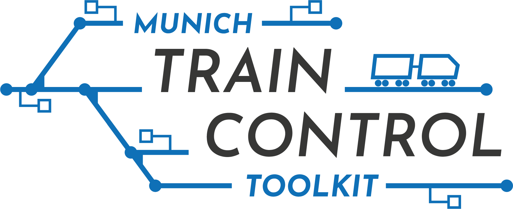

[](https://github.com/cda-tum/mtct/actions/workflows/cpp-ci.yml)
[](https://github.com/cda-tum/mtct/actions/workflows/codeql-analysis.yml)
[](https://codecov.io/gh/cda-tum/mtct)
[](https://github.com/cda-tum/mtct/blob/main/LICENSE)
[](https://cda-tum.github.io/mtct/)

# MTCT - Munich Train Control Toolkit

<p align="center">
  <picture>
    <source media="(prefers-color-scheme: dark)" srcset="_img/logo-train-control-toolkit-white-medium.png" width="60%">
    
  </picture>
</p>

## A Tool for Automated Design and Optimization of ETCS Systems with Hybrid Train Detection or Moving Block

Developers: Stefan Engels, Tom Peham, and Robert Wille

### Overview

The European Train Control System (ETCS) harmonizes many national train control systems.
Additionally, new specifications strive to increase the capacity of existing railway infrastructure.
This is mainly achieved by separating the trains more accurately than the trackside train detection (TTD) hardware allows.
If the existing TTD sections are subdivided into virtual subsections (VSS), which do not require additional hardware, one speaks of hybrid train detection (HTD, formerly known as ETCS Hybrid Level 3).
If no trackside train detection is used at all, the trains are separated by their reported positions only, which is known as moving block.

Both settings pose planning tasks that are non-trivial and are currently done mainly manually.
In our research at the [Chair for Design Automation](https://www.cda.cit.tum.de/) of the [Technical University of Munich](https://www.tum.de/en/), we develop methods that solve them automatically and optimally concerning various optimality criteria.
A journal article describing the arising design tasks in more detail is available [[7]](#references).

For hybrid train detection, one has to decide where to place the VSS borders.
First attempts using satisfiability solvers [[1]](#references) and heuristics [[2]](#references) have been implemented at [https://github.com/cda-tum/da_etcs](https://github.com/cda-tum/da_etcs).
Since the methods used there cannot model continuous properties directly, simplifying assumptions were made.
This tool provides a flexible approach in which designers can individually trade off the efficiency of the solving process and the model's accuracy.
Using an exact Mixed Integer Linear Programming (MILP) approach, it adds as few VSS as possible such that the timetable given in the instance can be operated exactly as specified [[3]](#references).
Its runtime has been improved by an iterative approach [[4]](#references) as well as by taking a precomputed moving block routing into account [[6]](#references).

For moving block, no layout has to be designed, and the question becomes how to route and schedule the trains themselves.
In this case, the times given in the instance are lower bounds only.
The tool finds routings that minimize a weighted combination of the delays at the stations and when leaving the network.
They can be obtained by a MILP [[5]](#references) as well as by an A\* search [[8]](#references) on simulated train movements, whose runtime and scalability are improved considerably by time-aware state transitions [[9]](#references).

All of these methods are built on a common problem description and are accessible through a command line app, which also builds and edits the instances they work on.
The tool is under active development, and more features will follow.

### Installation

#### System Requirements

The tool has been tested under Windows 11 (64-bit) using the MSVC compiler.
It should also be compatible with any other compiler supporting C++23, where a minimum CMake version of 3.20 is required.
More precisely, at least GCC 13.0, Clang 17.0, Apple Clang 16.0 (i.e., Xcode 16.0), or MSVC 19.34 (i.e., Visual Studio 2022 17.4) is needed.

Moreover, the tool requires a local installation of a recent Gurobi [[10]](#references) version available at [https://www.gurobi.com/downloads/gurobi-software/](https://www.gurobi.com/downloads/gurobi-software/) as well as a valid [license](https://www.gurobi.com/solutions/licensing/).
For academic purposes, Gurobi offers [free academic licenses](https://www.gurobi.com/academia/academic-program-and-licenses/).
The project currently tests with Gurobi v13.0.3.

#### Build

To build the tool, go to the project folder and execute the following:

1. Clone the submodules, if this has not already been done while cloning the repository.

   ```commandline
   git submodule update --init --recursive
   ```

2. Configure CMake

   ```commandline
   cmake -S . -B build -DCMAKE_BUILD_TYPE=Release
   ```

   If the default compiler is too old, a suitable one has to be specified explicitly, e.g., using the following command on Linux and MacOS

   ```commandline
   CXX=g++-13 CC=gcc-13 cmake -S . -B build -DCMAKE_BUILD_TYPE=Release
   ```

3. Build the respective target.
   ```commandline
   cmake --build build --config Release
   ```

When compiling, CMake automatically searches for Gurobi at the default locations, i.e.,

- `C:/gurobi<VERSION>/win64` for Windows systems
- `/home/opt/gurobi<VERSION>/linux64` for Linux systems
- `/Library/gurobi<VERSION>/macos_universal2` for MacOS systems
  where `<VERSION>` denotes the installed Gurobi version.

If this does not work, please set the OS environment variable GUROBI_HOME to the respective install directory.
This way, CMake can find Gurobi even in non-standard directories.

If you are using Windows, make sure that Gurobi's `bin` folder, i.e., `<installdir>\bin`, is appended to the `Path` environmental variable.
The above variables are usually automatically set, if Gurobi is installed using the installer with administrator privileges.
Otherwise, they have to be set manually, see also https://support.gurobi.com/hc/en-us/articles/360060996432-How-do-I-install-Gurobi-on-Windows-without-administrator-credentials-

### Usage

The tool is used through `rail_cli`, built into `build/apps/cli`.
It creates and edits problem instances and runs every solver on them, see [Interactive Sessions](#interactive-sessions).

In addition, each solver is available as a standalone app in `build/apps`, which solves one instance with one set of settings and terminates:

- `rail_vss_generation_timetable_mip_testing` generates minimal VSS layouts for a given timetable using a MILP.
- `rail_gen_po_moving_block_mip_testing` routes trains optimally under moving block control using a MILP.
- `rail_gen_po_moving_block_astar_testing` routes trains optimally under moving block control using an A\* search.

A solver has the same settings whether it is called through `rail_cli` or through its standalone app.
Called with `--help` (or `-h`), every app prints the full documentation of all of them, including their default values and their dependencies on each other.
The following only summarizes the general ideas; for the exact meaning of a setting, please refer to that output, which is included below for the three standalone apps.
Settings that exist in more than one solver use the same names everywhere.
Every setting has a long name, which is used below, and most of them additionally have a short one.

#### Instances and Solutions

All apps work on the same kind of problem instance, which consists of a railway network, a timetable, and routes.
Whether these routes are used or optimized again is up to the respective solver and its settings.
The timings of the timetable, however, are interpreted differently by the two problems.
For VSS generation they are fixed, whereas for moving block routing they are lower bounds whose violation is minimized.
An instance is identified by a working directory (`--working-directory`), a subdirectory (`--instance-subdirectory`), and its name (`--instance-name`), and is read from `working_directory/instances/instance_subdirectory/instance_name`.
In `rail_cli`, the same three are the working directory of the session and the two arguments of `instance load`.
Example instances can be found in `test/data/instances`.

By default, the solution is only printed and not saved.
Using `--export-solution` (or `--export-solution-and-instance`, if the instance is to be exported alongside it) together with a subdirectory given by `--solution-export-subdirectory`, it is written to `working_directory/solutions/solution_subdirectory/instance_subdirectory/instance_name`.
If the solutions belong somewhere else than the instances, a separate working directory can be given by `--export-working-directory`.
Since the same instance is often solved with different settings, an identifier can be appended to the instance name in the export path.
It is either specified explicitly by `--parameter-identifier` or generated from the used settings by `--generate-parameter-identifier`.

Hence, the instance _SimpleStation_ can be solved and exported by the following command:

```commandline
.\build\apps\rail_gen_po_moving_block_astar_testing --instance-name SimpleStation --instance-subdirectory atmos2023 --working-directory .\test\data --export-solution --solution-export-subdirectory my-solutions --generate-parameter-identifier
```

#### Interactive Sessions

`rail_cli` keeps one instance in memory for a whole session, so that it can be built or changed command by command and solved once it is in shape.

```commandline
.\build\apps\cli\rail_cli --working-directory .\test\data
```

A session looks as follows.

```
rail> instance load SimpleStation -s atmos2023
Loaded instance SimpleStation using network SimpleStation
rail (SimpleStation)> status
Working directory: C:\...\mtct\test\data
Instance:          SimpleStation (subdirectory atmos2023)
Network:           SimpleStation (of the instance)
rail (SimpleStation)> instance info
Instance:             SimpleStation (subdirectory atmos2023)
Network:              SimpleStation
Trains:               3
Stations:             1
Routes:               3
Station delay weight: 1
rail (SimpleStation)> network info
Network:   SimpleStation
Vertices:  11 (2 NoBorder, 9 TTD)
Edges:     22
Breakable: 10
rail (SimpleStation)> train weight tr1 2
Weight of tr1: 2
rail (SimpleStation)> status
Working directory: C:\...\mtct\test\data
Instance:          SimpleStation (subdirectory atmos2023)  [modified]
Network:           SimpleStation (of the instance)
rail (SimpleStation)> instance check
Consistent (every train routed): yes
Consistent (routes optional):    yes
Obviously infeasible:            no
```

`status` says where the session is, `instance info` and `network info` what the two objects contain, and `instance list` and `network list` what else the working directory has to offer.
`help` lists all commands, and every command explains its own settings with `--help`, for example `train add --help`.

```
status                                  network vertex add / change / list
help                                    network edge add / add-bidirectional / change / list
exit                                    network successor add / list
working-directory [<path>]
                                        station add / add-track / list
instance new / load / list / info       train add / change / schedule / weight / list
instance save / reload / close          train stop add / remove
instance check
instance station-delay-weight [<w>]     route add / clear / list

network new / load / list / info        solve mb-mip
network save / reload / close           solve mb-astar
network rename <new-name>               solve vss-mip
```

Nothing is written before you ask for it.
`instance save` writes the loaded instance, `network save` the network it uses, and `instance save --with-network` both at once.
Keeping the two apart matters because several instances can share one network, so a network is never overwritten as a side effect of saving an instance.
`status` marks what has been changed but not saved yet, and `instance reload` and `network reload` read the object back from disk, which is the quickest way out of a mistake.
`exit` refuses to end a session with unsaved changes and says so; `exit --force` ends it anyway and discards them.

`solve mb-mip`, `solve mb-astar`, and `solve vss-mip` run the solvers described in the following sections, with the settings documented there.
They work on the instance the session holds, including edits that have not been saved, so no `--instance-name` is needed:

```
rail (SimpleStation)> solve mb-astar --dt 6 --export-solution --solution-export-subdirectory my-solutions
```

Finally, the very same commands can be put in a file, one per line, and run with `--script`:

```commandline
.\build\apps\cli\rail_cli --working-directory .\test\data --script .\build_stammstrecke.rail
```

Such a file builds an instance reproducibly and keeps a record of how it was built next to it.
The session then continues at the prompt with everything the script has done, so a script can also be used to set up an instance that is afterwards worked on by hand.
Empty lines and lines starting with `#` are ignored, and `rail_cli < build_stammstrecke.rail` runs a file as well, but ends when it is through.

<details>
<summary>An example script</summary>

```
# a single track between two stations, with one train running along it
network new ExampleNetwork
network vertex add west -t TTD
network vertex add middle -t VSS
network vertex add east -t TTD
network edge add-bidirectional west middle -l 1000 -v 27.8
network edge add-bidirectional middle east -l 1000 -v 27.8
network successor add west middle middle east
network save

instance new ExampleInstance -s example --network ExampleNetwork
station add East
station add-track East middle east
train add RB1 -l 100 -v 27.8 -a 0.5 -d 0.5 --entry-vertex west --entry-time 0 --exit-vertex east --exit-time 900
train stop add RB1 East --service-time 300 --duration 60
route add RB1 west middle east
instance check
instance save
```

</details>

#### VSS Generation

`rail_vss_generation_timetable_mip_testing` adds as few VSS as possible such that the timetable of the instance can be operated exactly as specified.
The model can be built at different degrees of accuracy [[3]](#references).
Among others, the length of the discretized time intervals (`--delta-t`), whether the routes are fixed (`--fix-routes`), and whether train dynamics (`--train-dynamics`) and braking curves (`--braking-curves`) are respected can be chosen.
How the VSS borders themselves are modelled is controlled by `--vss-model-type`, where all but the continuous model additionally expect separation functions given by `--separation-functions`.

Instead of solving the full model at once, the number of VSS per edge can be increased iteratively by `--iterative-approach`, which often improves the runtime significantly [[4]](#references).
Independent of that, `--optimality-strategy` decides whether a proven optimal solution is required or whether a likely optimal one suffices, which is particularly relevant for the iterative approach.

Finally, a previously computed moving block routing of the very same instance can be used to guide the search [[6]](#references).
It is loaded by passing its solution subdirectory to `--moving-block-solution-subdirectory`, in which case additional settings control how much of that solution is fixed and how much is only hinted to the solver.

```commandline
.\build\apps\rail_vss_generation_timetable_mip_testing --instance-name SimpleStation --instance-subdirectory atmos2023 --working-directory .\test\data --delta-t 15 --vss-model-type Continuous
```

<details>
<summary>All settings of <code>rail_vss_generation_timetable_mip_testing</code></summary>

```commandline
VSS Generation Optimization using a MIP


.\build\apps\rail_vss_generation_timetable_mip_testing [OPTIONS]


OPTIONS:
  -h,     --help              Print this help message and exit

Instance:
  -n,     --instance-name TEXT REQUIRED
                              Name of the instance to solve. Will load instance in
                              working_directory/instances/instance_subdirectory/instance_name.
  -s,     --instance-subdirectory TEXT REQUIRED
                              Subdirectory of the instance to solve. Will load instance in
                              working_directory/instances/instance_subdirectory/instance_name.
  -d,     --working-directory TEXT REQUIRED
                              Working directory. Will load instance in
                              working_directory/instances/instance_subdirectory/instance_name.

Moving Block Information:
  -m,     --moving-block-solution-subdirectory TEXT Excludes: --free-routes
                              Subdirectory of a previously obtained moving block solution of
                              the very same instance. If (and only if) this option is set, the
                              solver using moving block information is used. The solution is
                              loaded from
                              moving_block_working_directory/solutions/moving_block_solution_subdirectory/instance_subdirectory/instance_name.
                              Note that the routes of the moving block solution supersede the
                              routes of the instance and that the discrete VSS model type is
                              not supported in this case.
          --moving-block-working-directory TEXT Needs: --moving-block-solution-subdirectory
                              Working directory from which the moving block solution is loaded.
                              If unset, the normal working directory is used.
          --moving-block-parameter-identifier TEXT Needs: --moving-block-solution-subdirectory
                              Parameter identifier that was appended to the instance name when
                              the moving block solution was exported. If empty, no parameter
                              identifier is assumed.
  -z{false}, --free-stop-positions{false}, --fix-stop-positions Needs: --moving-block-solution-subdirectory
                              The positions at which trains stop at a station are fixed to the
                              ones of the moving block solution by default. If this flag is
                              negated (-z or --free-stop-positions), they are optimized again.
  -l{false}, --free-exact-positions{false}, --fix-exact-positions Needs: --moving-block-solution-subdirectory
                              The exact positions of the trains at every vertex are fixed to
                              the ones of the moving block solution by default. If this flag is
                              negated (-l or --free-exact-positions), they are only bounded by
                              their minimal and maximal positions.
  -y{false}, --free-exact-velocities{false}, --fix-exact-velocities Needs: --moving-block-solution-subdirectory
                              The exact velocities of the trains at every vertex are fixed to
                              the ones of the moving block solution by default. If this flag is
                              negated (-y or --free-exact-velocities), they are optimized
                              again.
  -u{false}, --no-position-hints{false}, --hint-approximate-positions Needs: --moving-block-solution-subdirectory
                              The approximate positions of the trains at every point in time
                              are hinted to the solver by default. If this flag is negated (-u
                              or --no-position-hints), no such hints are given.
  -w{false}, --free-order-on-edges{false}, --fix-order-on-edges Needs: --moving-block-solution-subdirectory
                              The order in which the trains traverse the edges is fixed to the
                              one of the moving block solution by default. If this flag is
                              negated (-w or --free-order-on-edges), the order is optimized
                              again.

Model Parameters:
  -c,     --delta-t, --dt, --timestep FLOAT:POSITIVE [15]
                              Length of the discretized time intervals in seconds.
  -f{false}, --free-routes{false}, --fix-routes Excludes: --moving-block-solution-subdirectory
                              The routes given by the instance are fixed by default. If this
                              flag is negated (-f or --free-routes), the routes are optimized
                              as well. Not applicable together with moving block information,
                              in which case the routes are always fixed to the ones of the
                              moving block solution.
  -a{false}, --no-train-dynamics{false}, --train-dynamics
                              The train dynamics (i.e., limited acceleration and deceleration)
                              are included in the model by default. If this flag is negated (-a
                              or --no-train-dynamics), they are omitted.
  -k{false}, --no-braking-curves{false}, --braking-curves
                              The braking curves (i.e., the braking distance depending on the
                              current speed has to be cleared) are included in the model by
                              default. If this flag is negated (-k or --no-braking-curves),
                              they are omitted.
  -r,     --vss-model-type ENUM:value in {Continuous->1,Discrete->0,Inferred->2,InferredAlt->3} OR {1,0,2,3} [1]
                              Denotes how the VSS borders are modelled in the solution process.
                              Currently supports 'Discrete', 'Continuous', 'Inferred', and
                              'InferredAlt'. 'Discrete' expects exactly one, 'Inferred' and
                              'InferredAlt' expect at least one separation function, whereas
                              'Continuous' expects none.
  -j,     --separation-functions ENUM:value in {Chebyshev->1,Uniform->0} OR {1,0} ...
                              Separation functions used by the VSS model type. Can be passed
                              multiple times. Currently supports 'Uniform' and 'Chebyshev'.
          --only-stop-at-vss  If this flag is set, trains are only allowed to stop at VSS
                              borders.
          --use-pwl           If this flag is set, the braking distances are approximated by
                              piecewise linear functions with a fixed maximal error. Otherwise
                              (by default) they are modelled as quadratic functions using
                              Gurobi's ability to solve these by spatial branching. Only
                              relevant if braking curves are included.
          --no-schedule-cuts{false}, --use-schedule-cuts
                              The formulation is strengthened using cuts implied by the
                              schedule by default. If this flag is negated
                              (--no-schedule-cuts), these cuts are omitted.

Solver Parameters:
  -x,     --iterative-approach
                              If this flag is set, the number of VSS per edge is iteratively
                              increased until optimality is proven instead of solving the full
                              model at once.
  -q,     --optimality-strategy ENUM:value in {Feasible->2,Optimal->0,TradeOff->1} OR {2,0,1} [0]
                              Optimality strategy to use. Currently supports 'Optimal',
                              'TradeOff', and 'Feasible'.
          --iterative-update-strategy ENUM:value in {Fixed->0,Relative->1} OR {0,1} [0]  Needs: --iterative-approach
                              Strategy used to update the number of VSS per edge within the
                              iterative approach. Currently supports 'Fixed' (absolute number)
                              and 'Relative' (fraction of the theoretically possible number).
          --iterative-initial-value FLOAT:POSITIVE [1]  Needs: --iterative-approach
                              Initial number of VSS per edge ('Fixed' update strategy, has to
                              be an integer) or initial fraction of the theoretically possible
                              number ('Relative' update strategy, has to be within (0,1]) used
                              by the iterative approach.
          --iterative-update-value FLOAT:POSITIVE [2]  Needs: --iterative-approach
                              Value by which the number of VSS per edge is increased in every
                              iteration. Has to be greater than 1 for the 'Fixed' and within
                              (0,1) for the 'Relative' update strategy.
          --no-iterative-cuts{false}, --iterative-cuts Needs: --iterative-approach
                              Cuts excluding the already explored search space are added in
                              every iteration of the iterative approach by default. If this
                              flag is negated (--no-iterative-cuts), these cuts are omitted.

Additional Solving Parameters:
  -t,     --time-limit INT [-1]
                              Time limit in seconds for the solver to run. No limit if
                              negative.
  -v,     --verbose, --debug  Whether to output debug information during the solving process.
                              Default: no debug output.

Export Options:
  -o,     --export-solution Needs: --solution-export-subdirectory Excludes: --export-solution-and-instance
                              Export the solution.
  -i,     --export-solution-and-instance Needs: --solution-export-subdirectory Excludes: --export-solution
                              Export the solution and the instance.
          --export-lp-model Needs: --solution-export-subdirectory
                              Export the MIP model itself (as .mps and, if a solution exists,
                              as .sol) into the solution directory.
  -b,     --export-working-directory TEXT: Needs: --export-solution, --export-solution-and-instance or --export-lp-model
                              Working directory for exporting solutions. If unset, the normal
                              working directory is used.
  -e,     --solution-export-subdirectory TEXT: Needs: --export-solution, --export-solution-and-instance or --export-lp-model
                              Subdirectory to export the solution to. Will be created in
                              export_working_directory/solutions/solution_subdirectory/instance_subdirectory/instance_name-parameters.
          --model-name TEXT: Needs: --export-solution, --export-solution-and-instance or --export-lp-model [model]  Needs: --export-lp-model
                              File name (without extension) used when exporting the MIP model
                              itself.
          --postprocess       If this flag is set, the solution is postprocessed to remove
                              potentially unused VSS.
  -p,     --parameter-identifier TEXT Excludes: --generate-parameter-identifier
                              Optional identifier to distinguish different parameterizations of
                              the same instance. Will be appended to the instance name in the
                              export path as instance_name-parameter_identifier. If empty, no
                              parameter identifier will be appended
  -g,     --generate-parameter-identifier Excludes: --parameter-identifier
                              Whether to automatically generate a parameter identifier based on
                              the parameter settings. If set, the parameter identifier will be
                              generated as a concatenation of the parameter names and values.
                              Otherwise the identifier has to be set explicitly if it should
                              not remain empty.
```

</details>

#### Routing on Moving Block Networks

Both moving block apps solve the same problem, namely routing and scheduling the trains such that they are separated by moving block.
The times given in the instance are lower bounds only, and the objective is to minimize the weighted delays at the stations and when leaving the network.
Unless `--allow-late-entry` is used, the trains enter the network exactly at their scheduled time.
The two apps only differ in the method used to solve this problem.

##### MILP Based

`rail_gen_po_moving_block_mip_testing` uses a MILP in which the headway constraints are separated lazily [[5]](#references).
Which violated constraints are added is controlled by `--lazy-constraint-selection-strategy`, and which train pairs are checked at all by `--lazy-train-selection-strategy`.
Lazy separation can also be switched off by `--no-lazy-constraints`, in which case the full model is passed to Gurobi upfront.
Alternatively, `--simplify-headway-constraints` uses simplified headway constraints, which are faster to solve but might not separate the trains accurately.
This is worth considering if the results are only used to make preliminary decisions.

Moreover, the delays can be bounded, either separately by `--max-exit-delay` and `--max-station-delay` or jointly by `--max-delay`.
Finally, the granularity of the velocity extensions can be adapted by `--max-velocity-delta` and `--velocity-refinement-strategy`.

```commandline
.\build\apps\rail_gen_po_moving_block_mip_testing --instance-name SimpleStation --instance-subdirectory atmos2023 --working-directory .\test\data --time-limit 3600
```

<details>
<summary>All settings of <code>rail_gen_po_moving_block_mip_testing</code></summary>

```commandline
Moving Block Optimization using a MIP


.\build\apps\rail_gen_po_moving_block_mip_testing [OPTIONS]


OPTIONS:
  -h,     --help              Print this help message and exit

Instance:
  -n,     --instance-name TEXT REQUIRED
                              Name of the instance to solve. Will load instance in
                              working_directory/instances/instance_subdirectory/instance_name.
  -s,     --instance-subdirectory TEXT REQUIRED
                              Subdirectory of the instance to solve. Will load instance in
                              working_directory/instances/instance_subdirectory/instance_name.
  -d,     --working-directory TEXT REQUIRED
                              Working directory. Will load instance in
                              working_directory/instances/instance_subdirectory/instance_name.

Model Parameters:
  -f,     --fix-routes        If this flag is set, the routes given by the instance are fixed.
                              Otherwise (by default) the routes are optimized as well.
  -m,     --max-velocity-delta FLOAT:POSITIVE [5.55]
                              Maximal velocity difference (in m/s) between two consecutive
                              velocity extensions of a train.
  -r,     --velocity-refinement-strategy ENUM:value in {MinOneStep->1,None->0} OR {1,0} [1]
                              Strategy used to refine the velocity extensions. Currently
                              supports 'None' and 'MinOneStep'.
  -y,     --simplify-headway-constraints
                              If this flag is set, simplified (weaker) headway constraints are
                              used instead of the full ones.
  -q,     --strengthen-vertex-headway-constraints
                              If this flag is set, the vertex headway constraints are
                              strengthened.
  -l,     --allow-late-entry  Allow late entry (delays) in the solution (default without flag
                              is false)
          --no-minimum-time-bounds{false}, --use-minimum-time-bounds
                              Every timing variable is bounded by the minimal running time the
                              train needs to reach the corresponding event by default. If this
                              flag is negated (--no-minimum-time-bounds), these bounds are
                              omitted, which weakens the LP relaxation considerably and is only
                              useful to measure their effect.
  -x,     --max-exit-delay FLOAT:NONNEGATIVE [86400]  Excludes: --max-delay
                              Maximal delay (in seconds) with which a train is allowed to leave
                              the network compared to its scheduled exit time.
          --max-station-delay FLOAT:NONNEGATIVE [86400]  Excludes: --max-delay
                              Maximal delay (in seconds) with which a train is allowed to be
                              serviced at a station compared to its scheduled service time.
          --max-delay FLOAT:NONNEGATIVE Excludes: --max-exit-delay --max-station-delay
                              Maximal delay (in seconds) used for both the exit and the station
                              delay at once. Mutually exclusive with the individual
                              --max-exit-delay and --max-station-delay settings.

Solver Parameters:
  -c,     --use-indicator-constraints
                              If this flag is set, indicator constraints are used instead of
                              big-M formulations where possible.
  -z{false}, --no-lazy-constraints{false}, --use-lazy-constraints
                              Headway constraints are separated lazily by default. If this flag
                              is negated (-z or --no-lazy-constraints), they are added to the
                              model upfront and all remaining lazy settings are ignored.
  -w,     --include-reverse-headways
                              If this flag is set, headways on reverse edges are separated as
                              well. Only possible together with lazy constraints using the
                              'AllChecked' lazy constraint selection strategy.
  -u,     --include-higher-velocities-in-edge-expr
                              If this flag is set, higher velocities are included in the edge
                              expressions of the lazy headway constraints.
  -j,     --lazy-constraint-selection-strategy ENUM:value in {AllChecked->2,OnlyFirstFound->1,OnlyViolated->0} OR {2,1,0} [0]
                              Strategy deciding which violated lazy constraints are added.
                              Currently supports 'OnlyViolated', 'OnlyFirstFound', and
                              'AllChecked'.
  -k,     --lazy-train-selection-strategy ENUM:value in {All->1,OnlyAdjacent->0} OR {1,0} [0]
                              Strategy deciding which train pairs are checked when separating
                              lazy constraints. Currently supports 'OnlyAdjacent' and 'All'.
  -a,     --abs-mip-gap FLOAT:NONNEGATIVE [10]
                              Absolute MIP gap used as termination criterion of the solver.

Additional Solving Parameters:
  -t,     --time-limit INT [-1]
                              Time limit in seconds for the solver to run. No limit if
                              negative.
  -v,     --verbose, --debug  Whether to output debug information during the solving process.
                              Default: no debug output.

Export Options:
  -o,     --export-solution Needs: --solution-export-subdirectory Excludes: --export-solution-and-instance
                              Export the solution.
  -i,     --export-solution-and-instance Needs: --solution-export-subdirectory Excludes: --export-solution
                              Export the solution and the instance.
          --export-lp-model Needs: --solution-export-subdirectory
                              Export the MIP model itself (as .mps and, if a solution exists,
                              as .json) into the solution directory.
  -b,     --export-working-directory TEXT: Needs: --export-solution, --export-solution-and-instance or --export-lp-model
                              Working directory for exporting solutions. If unset, the normal
                              working directory is used.
  -e,     --solution-export-subdirectory TEXT: Needs: --export-solution, --export-solution-and-instance or --export-lp-model
                              Subdirectory to export the solution to. Will be created in
                              export_working_directory/solutions/solution_subdirectory/instance_subdirectory/instance_name-parameters.
          --model-name TEXT: Needs: --export-solution, --export-solution-and-instance or --export-lp-model [model]  Needs: --export-lp-model
                              File name (without extension) used when exporting the MIP model
                              itself.
  -p,     --parameter-identifier TEXT Excludes: --generate-parameter-identifier
                              Optional identifier to distinguish different parameterizations of
                              the same instance. Will be appended to the instance name in the
                              export path as instance_name-parameter_identifier. If empty, no
                              parameter identifier will be appended
  -g,     --generate-parameter-identifier Excludes: --parameter-identifier
                              Whether to automatically generate a parameter identifier based on
                              the parameter settings. If set, the parameter identifier will be
                              generated as a concatenation of the parameter names and values.
                              Otherwise the identifier has to be set explicitly if it should
                              not remain empty.
```

</details>

##### A\* Based

`rail_gen_po_moving_block_astar_testing` searches for such a routing using an A\* search on simulated train movements [[8,9]](#references).
The time step of that simulation is given by `--dt`.
How far the trains are moved in every step is controlled by `--next-state-strategy`, and which heuristic estimates the remaining time by `--remaining-time-heuristic-strategy`.
Using `--time-aware-state-transitions`, states that cannot lead to a better solution are not explored, which reduces the runtime drastically.
If a proven optimal solution is not needed, `--heuristic-weight` allows to weight the heuristic, which speeds up the search while still guaranteeing an approximation factor.
In contrast to the MILP, the A\* search does not support bounding the delays.

```commandline
.\build\apps\rail_gen_po_moving_block_astar_testing --instance-name SimpleStation --instance-subdirectory atmos2023 --working-directory .\test\data --dt 6 --time-aware-state-transitions
```

<details>
<summary>All settings of <code>rail_gen_po_moving_block_astar_testing</code></summary>

```commandline
Moving Block Optimization using A*


.\build\apps\rail_gen_po_moving_block_astar_testing [OPTIONS]


OPTIONS:
  -h,     --help              Print this help message and exit

Instance:
  -n,     --instance-name TEXT REQUIRED
                              Name of the instance to solve. Will load instance in
                              working_directory/instances/instance_subdirectory/instance_name.
  -s,     --instance-subdirectory TEXT REQUIRED
                              Subdirectory of the instance to solve. Will load instance in
                              working_directory/instances/instance_subdirectory/instance_name.
  -d,     --working-directory TEXT REQUIRED
                              Working directory. Will load instance in
                              working_directory/instances/instance_subdirectory/instance_name.

Model Parameters:
  -c,     --dt, --timestep FLOAT:POSITIVE [6]
                              Time step (dt) used in the simulation
  -l,     --allow-late-entry  Allow late entry (delays) in the solution (default without flag
                              is false)
  -f{false}, --speed-limit-only-on-train-front{false}, --limit-speed-by-leaving-edges
                              If this flag is set, trains only respect the limit of their front
                              position. Otherwise (by default) any edge's speed limit any part
                              of the train is on applies, i.e., by default speed limits of
                              edges the train is leaving (and the front already left) are also
                              relevant.
  -y{false}, --allow-early-exit{false}, --consider-earliest-exit
                              Allow to leave stations and the network early. By defaults trains
                              cannot leave before the scheduled time, i.e., the earliest exit
                              times imposed by the schedule are respected.

Solver Parameters:
  -a,     --time-aware-state-transitions
                              If this flag is set, use time aware state transitions to avoid
                              unnecessary state exploration.
  -w,     --heuristic-weight FLOAT:FLOAT in [1 - 1.79769e+308] [1]
                              Weight of the heuristic to use in the (weighted) A*. Has to be
                              >=1. If w is the weight, then A* is an w-approximation.
  -x,     --next-state-strategy ENUM:value in {NextRelevantTTD->2,NextTTD->1,SingleEdge->0} OR {2,1,0} [0]
                              Next state strategy to use in the A* search. Currently supports
                              'SingleEdge', 'NextTTD', and 'NextRelevantTTD'.
  -r,     --remaining-time-heuristic-strategy ENUM:value in {Simple->1,Zero->0} OR {1,0} [1]
                              Remaining time heuristic strategy to use in the simulation.
                              Currently supports 'Zero' and 'Simple'

Additional Solving Parameters:
  -t,     --time-limit INT [-1]
                              Time limit in seconds for the solver to run. No limit if
                              negative.
  -v,     --verbose, --debug  Whether to output debug information during the solving process.
                              Default: no debug output.

Export Options:
  -o,     --export-solution Needs: --solution-export-subdirectory Excludes: --export-solution-and-instance
                              Export the solution.
  -i,     --export-solution-and-instance Needs: --solution-export-subdirectory Excludes: --export-solution
                              Export the solution and the instance.
  -b,     --export-working-directory TEXT: Needs: --export-solution or --export-solution-and-instance
                              Working directory for exporting solutions. If unset, the normal
                              working directory is used.
  -e,     --solution-export-subdirectory TEXT: Needs: --export-solution or --export-solution-and-instance
                              Subdirectory to export the solution to. Will be created in
                              export_working_directory/solutions/solution_subdirectory/instance_subdirectory/instance_name-parameters.
  -p,     --parameter-identifier TEXT Excludes: --generate-parameter-identifier
                              Optional identifier to distinguish different parameterizations of
                              the same instance. Will be appended to the instance name in the
                              export path as instance_name-parameter_identifier. If empty, no
                              parameter identifier will be appended
  -g,     --generate-parameter-identifier Excludes: --parameter-identifier
                              Whether to automatically generate a parameter identifier based on
                              the parameter settings. If set, the parameter identifier will be
                              generated as a concatenation of the parameter names and values.
                              Otherwise the identifier has to be set explicitly if it should
                              not remain empty.
```

</details>

#### Access via C++

Additionally, one can call the public methods to create, save, load, and solve respective instances in C++ directly.
For this, we refer to the source code's docstrings and example usages in the Google Tests found in the `test` folder.

## Contact Information

If you have any questions, feel free to contact us via etcs.cda@xcit.tum.de or by creating an issue on GitHub.

## References

[[1]](https://www.cda.cit.tum.de/files/eda/2021_date_automatic_design_verification_level3_etcs.pdf) Robert Wille and Tom Peham and Judith Przigoda and Nils Przigoda. **"Towards Automatic Design and Verification for Level 3 of the European Train Control System"**. Design, Automation and Test in Europe (DATE), 2021 ([doi](https://doi.org/10.23919/DATE51398.2021.9473935), [pdf](https://www.cda.cit.tum.de/files/eda/2021_date_automatic_design_verification_level3_etcs.pdf))

[[2]](https://www.cda.cit.tum.de/files/eda/2022_rssrail_optimal_railway_routing_using_virtual_subsections.pdf) Tom Peham and Judith Przigoda and Nils Przigoda and Robert Wille. **"Optimal Railway Routing Using Virtual Subsections"**. Reliability, Safety and Security of Railway Systems (RSSRail), 2022 ([doi](https://doi.org/10.1007/978-3-031-05814-1_5), [pdf](https://www.cda.cit.tum.de/files/eda/2022_rssrail_optimal_railway_routing_using_virtual_subsections.pdf))

[[3]](https://www.cda.cit.tum.de/files/eda/2023_atmos_a_symbolic_design_method_for_etcs_hl3_at_different_degrees_of_accuracy.pdf) Stefan Engels and Tom Peham and Robert Wille. **"A Symbolic Design Method for ETCS Hybrid Level 3 at Different Degrees of Accuracy"**. Symposium on Algorithmic Approaches for Transportation Modelling, Optimization, and Systems (ATMOS), 2023 ([doi](https://doi.org/10.4230/OASIcs.ATMOS.2023.6), [pdf](https://www.cda.cit.tum.de/files/eda/2023_atmos_a_symbolic_design_method_for_etcs_hl3_at_different_degrees_of_accuracy.pdf))

[[4]](https://www.cda.cit.tum.de/files/eda/2024_date_lbr_iterative_da_for_train_control_with_htd.pdf) Stefan Engels and Robert Wille. **"Late Breaking Results: Iterative Design Automation for Train Control with Hybrid Train Detection"**. Design, Automation and Test in Europe (DATE), 2024 ([doi](https://doi.org/10.23919/DATE58400.2024.10546590), [pdf](https://www.cda.cit.tum.de/files/eda/2024_date_lbr_iterative_da_for_train_control_with_htd.pdf))

[[5]](https://www.cda.cit.tum.de/files/eda/2024_fedcsis_lazy_constraint_selection_strategies_moving_block.pdf) Stefan Engels and Robert Wille. **"Comparing Lazy Constraint Selection Strategies in Train Routing with Moving Block Control"**. Conference on Computer Science and Intelligence Systems (FedCSIS), 2024 ([doi](https://doi.org/10.15439/2024F3041), [arXiv](https://arxiv.org/abs/2405.18977), [pdf](https://www.cda.cit.tum.de/files/eda/2024_fedcsis_lazy_constraint_selection_strategies_moving_block.pdf))

[[6]](https://www.cda.cit.tum.de/files/eda/2024_atmos_optimization_pipieline_for_train_control_with_htd.pdf) Stefan Engels and Robert Wille. **"Towards an Optimization Pipeline for the Design of Train Control Systems with Hybrid Train Detection"**. Symposium on Algorithmic Approaches for Transportation Modelling, Optimization, and Systems (ATMOS), 2024 ([doi](https://doi.org/10.4230/OASIcs.ATMOS.2024.12), [pdf](https://www.cda.cit.tum.de/files/eda/2024_atmos_optimization_pipieline_for_train_control_with_htd.pdf))

[[7]](https://www.cda.cit.tum.de/files/eda/2025_eurojtl_etcs_design_tasks_and_complexity.pdf) Stefan Engels and Tom Peham and Judith Przigoda and Nils Przigoda and Robert Wille. **"Design tasks and their complexity for the European Train Control System with Hybrid Train Detection"**. EURO Journal on Transportation and Logistics, 2025 ([doi](https://doi.org/10.1016/j.ejtl.2025.100161), [arXiv](https://arxiv.org/abs/2308.02572), [pdf](https://www.cda.cit.tum.de/files/eda/2025_eurojtl_etcs_design_tasks_and_complexity.pdf))

[[8]](https://www.cda.cit.tum.de/files/eda/2025_atmos_astar_for_optimal_routing_on_moving_block_systems.pdf) Stefan Engels and Robert Wille. **"Using A\* for Optimal Train Routing on Moving Block Systems"**. Symposium on Algorithmic Approaches for Transportation Modelling, Optimization, and Systems (ATMOS), 2025 ([doi](https://doi.org/10.4230/OASIcs.ATMOS.2025.14), [pdf](https://www.cda.cit.tum.de/files/eda/2025_atmos_astar_for_optimal_routing_on_moving_block_systems.pdf))

[[9]](https://www.cda.cit.tum.de/files/eda/2026_atmos_timeaware_astar_mb.pdf) Stefan Engels and Robert Wille. **"Time-Aware A\* for Optimal Train Routing on Moving Block Systems"**. Symposium on Algorithmic Approaches for Transportation Modelling, Optimization, and Systems (ATMOS), 2026 ([pdf](https://www.cda.cit.tum.de/files/eda/2026_atmos_timeaware_astar_mb.pdf))

[[10]](https://www.gurobi.com) Gurobi Optimization, LLC. **"Gurobi Optimizer Reference Manual"**. 2026
